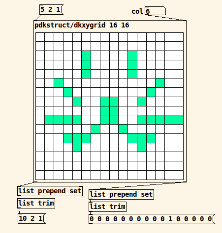
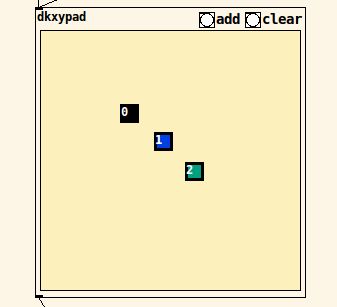

# pdkstruct (gpl v 3)
pure data abstractions focused on [struct]s

- dkxygrid: an xy grid (args are x-dim, y-dim) with dumpable column data

- dkxypad: an xy pad with multiple controls (inspired by chr15m's s-controlsurface)

